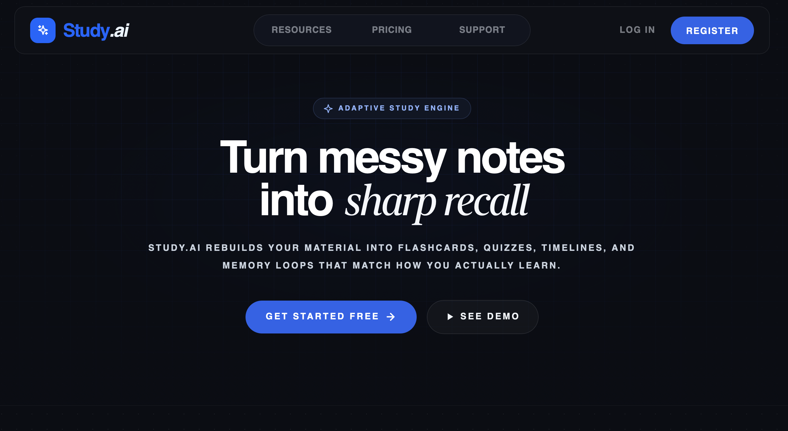
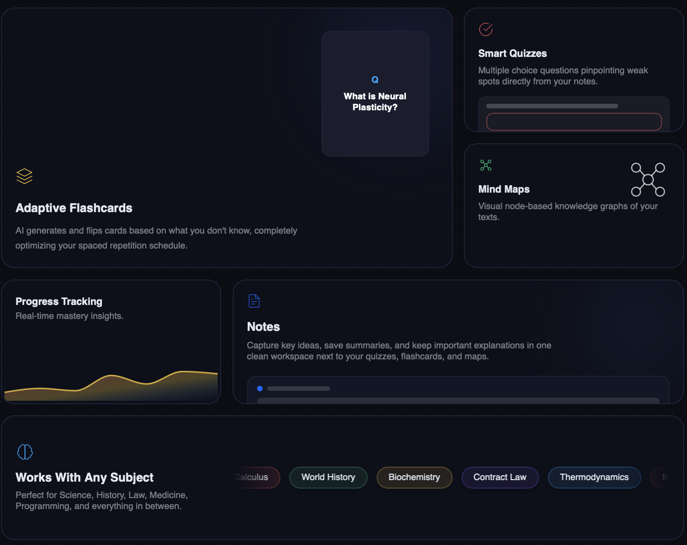

  

  <strong>Upload once. Learn in every mode.</strong>

  Study.ai is a modern AI-powered study platform that transforms learning materials into an interactive study experience.

  
  
  

  <a href="#overview">Overview</a> •
  <a href="#product-tour">Product Tour</a> •
  <a href="#why-studyai">Why Study.ai</a> •
  <a href="#contributors">Contributors</a>

---

## Overview

Study.ai is built for learners who want more than static notes or isolated tools.

Instead of jumping between different apps for summaries, flashcards, quizzes, and visual learning, the platform brings everything into one focused experience. A single study source can evolve into multiple learning modes, helping students stay in flow and learn faster.

## Product Tour

### Main Page

The main experience is designed as a study workspace where learners can move naturally from content to action.

  

### How It Works

Study.ai follows a simple product idea: turn study material into an active learning journey.

  

## Why Study.ai

### One place for the full study flow

Study.ai is not designed as a single-feature tool. It is built as one connected environment where learners can upload, explore, practice, and revisit material without breaking focus.

### Built for active learning

The platform is centered around interaction. Instead of only reading, learners can engage with material through multiple formats that make repetition and understanding feel more dynamic.

### Designed to feel like a product, not a demo

Study.ai is shaped as a real workspace experience with product thinking behind it: clear flow, visual identity, and a learning-first interface.

## What Learners Can Do

- Explore study materials in one workspace
- Move through multiple study modes from the same source
- Learn with AI-assisted experiences
- Switch between reading, reviewing, and practicing
- Stay inside a more immersive and less fragmented study flow

## Project Identity

Study.ai is a product-focused learning experience that blends AI, interaction, and modern interface design into one platform.

It is meant to feel clear, useful, and ambitious from the first screen.

## Contributors

  

  <a href="https://github.com/juniorqazaq/study.ai/graphs/contributors">View full contributors graph</a>

